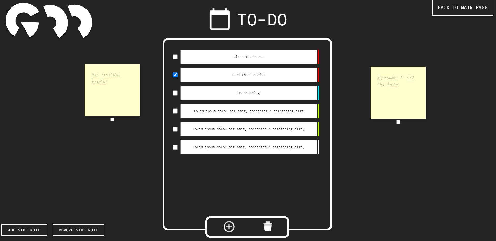

# Goo-App
## A website with my library of simple vanilla javaScript projects. <br />
> Live: https://admiring-aryabhata-bb43d5.netlify.app/
 ## Site contains:
| Games                 | Tools       | 
| :---                  |    :----:   |     
| Aim-Trainer           | To-do       | 
| Space-Invaders        | Notes       | 
| Rock-paper-scissors   | Calculator  | 

 ### Technology stack:
 - HTML, with BEM metodology
 - SCSS
 - JavaScript
 - GSAP

## How it's work?
### To-do app:

### The application allows you to add tasks unlimitedly.
<br> Additionally, the user can also 'stick' note's with any content. The sticky note can later be placed anywhere on the screen.
<br> Any content that user creates is then saved in local storage.

---
 ### History of the creation process
 At the beginning I used parcel, and highway.js library, but along the process highway.js turned out that is not the best choice for this project. <br> I gave up this library and made everything much simpler
 <br> <br> At this moment redirect animations look's like that: 
 - First loading animation:

```Java Script
    const loadAnimation = () => {
    tl.fromTo(contentTools, {opacity: 0}, {opacity: 1, duration: 0.5});
    contentGames.style.display = "none";
    contentInfo.style.display = "none";

    loadAnimation()
```
- Navigate to Tools, for example:
 ```Java Script
    const navigateToGames = () =>{
    btnToGames.classList.add('nav-list__element--active');
    if(currentView === "tools"){
        btnToTools.classList.remove('nav-list__element--active');
        tl.fromTo(contentTools, {opacity: 1}, {opacity: 0, display: "none", duration: 0.5});
    }
    else if(currentView === "info"){
        btnToInfo.classList.remove('nav-list__element--active');
        tl.fromTo(contentInfo, {opacity: 1}, {opacity: 0, display: "none", duration: 0.5});
    }
    tl.fromTo(contentGames, {opacity: 0}, {opacity: 1, display: "flex", duration: 0.5});
    currentView = "games";
}
```


